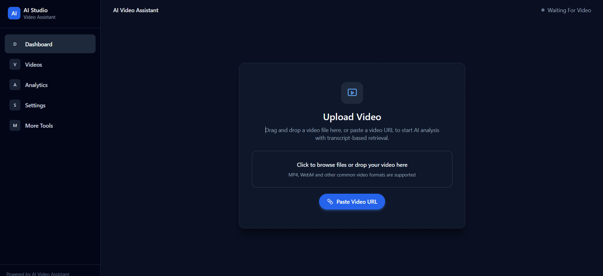
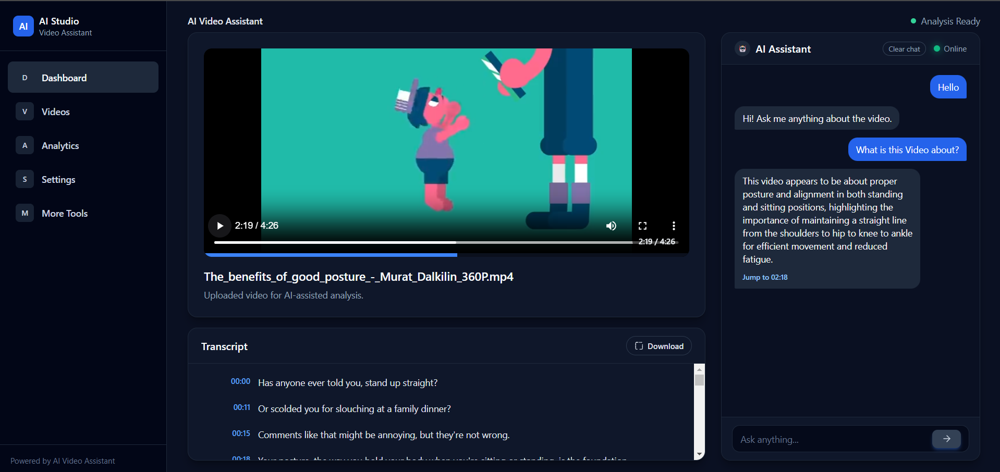
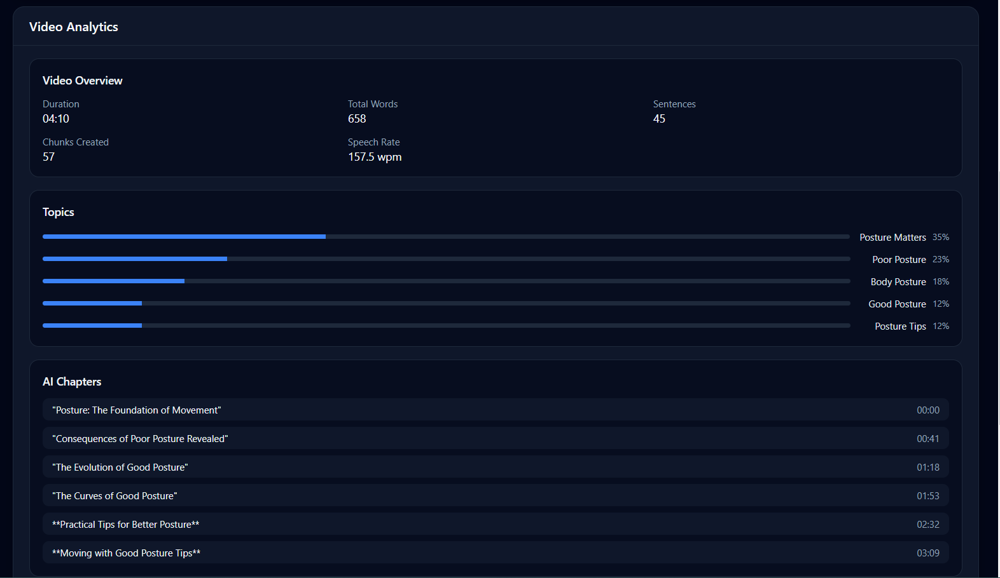
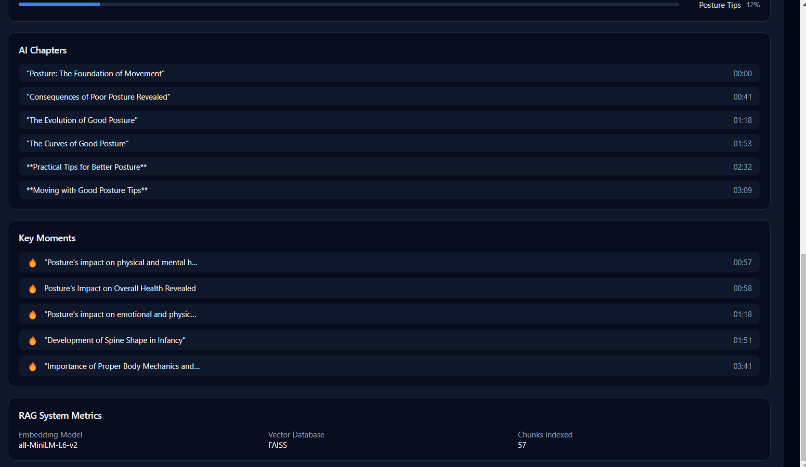

# 🎥 AI Video Assistant – Frontend

A modern **AI-powered video analysis interface** that allows users to upload videos, explore transcripts, analyze topics, and interact with an **AI assistant that understands video content using RAG and LLM reasoning**.

This frontend provides an intuitive interface for interacting with the backend AI pipeline that performs:

Users can upload videos and **ask natural language questions about the content**, instantly retrieving the most relevant video segments.

---

# 🚀 Demo

## Upload Video Interface

Users can upload videos or paste video URLs to start AI analysis.

---

## Video Player + AI Chat

Users can interact with the video using a conversational AI assistant that retrieves relevant transcript segments.

---

## Video Analytics Dashboard

Provides insights extracted from the video including:

- Duration
- Word count
- Speech rate
- Topic distribution
- Semantic chunk statistics

---

## AI Chapters & Key Moments

The system automatically generates:

- AI chapters
- Important moments
- Topic breakdown

---

# ✨ Features

### 🎬 Video Upload & Processing
- Upload video files directly
- Paste video URLs
- Automatic AI analysis pipeline

---

### 💬 AI Video Chat

Ask natural language questions about the video.

Example:

The AI retrieves relevant transcript chunks and generates answers using **RAG (Retrieval Augmented Generation)**.

Features:

- Context-aware answers
- Timestamp navigation
- Jump to relevant video moments

---

### 📜 Transcript Viewer

- Timestamp aligned transcript
- Scrollable transcript interface
- Download transcript option

Example:

---

### 📊 Video Analytics

The system analyzes video content to extract insights.

Example metrics:

---

### 🧠 Topic Detection

Automatically detects semantic topics from the video.

Example:

---

### 📚 AI Chapters

Semantic segmentation generates chapters automatically.

Example:

---

---

### 🔥 Key Moments Detection

Highlights the most important moments in the video.

Example:

---

### 🧠 RAG System Metrics

Displays information about the AI retrieval system.

Example:

---

# 🧠 Architecture Overview

The frontend communicates with a backend ML pipeline that performs:

Video Upload
↓
Audio Extraction
↓
Speech Recognition (Whisper)
↓
Transcript Segmentation
↓
Embedding Generation
↓
Vector Indexing (FAISS)
↓
Semantic Retrieval
↓
LLM Response Generation

This enables **semantic search and conversational interaction with video content**.

---

# 🛠️ Tech Stack

Frontend built with modern web technologies.

Core stack includes:

- React / Next.js
- TypeScript
- TailwindCSS
- Video.js
- REST API integration

---
